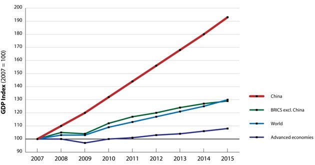

Graham Allison's article "The Thucydides Trap: Are the U.S. and China headed for War?" published in this month's Atlantic reviews the rise of China in the context of other rising nations and the challenges they pose to incumbents. Notably, he points out that the mere presence of a challenger can cause such anxiety as to precipitate war. This is the Thucydides Trap. To demonstrate China's rise, Allison wrote, 

> While the Western press is seized by the storyline of “China’s economic slowdown,” few pause to note that China’s lower growth rate remains more than three times that of the United States. Many observers outside China have missed the great divergence between China’s economic performance and that of its competitors over the seven years since the financial crisis of 2008 and Great Recession. That shock caused virtually all other major economies to falter and decline. China never missed a year of growth, sustaining an average growth rate exceeding 8 percent. _Indeed, since the financial crisis, nearly 40 percent of all growth in the global economy has occurred in just one country: China _(emphasis added). The chart below illustrates China’s growth compared to growth among its peers in the BRICS group of emerging economies, advanced economies, and the world. From a common index of 100 in 2007, the divergence is dramatic.

|  |
|:---:|
| *Harvard Belfer Center / IMF World Economic Outlook* |

He continues...
  
> What Xi Jinping calls the “[China Dream](http://www.theatlantic.com/international/archive/2015/09/xi-jinping-china-book-chinese-dream/406387/)” expresses the deepest aspirations of hundreds of millions of Chinese, who wish to be not only rich but also powerful. At the core of China’s civilizational creed is the belief—or conceit—that China is the center of the universe. In the oft-repeated narrative, a century of Chinese weakness led to exploitation and national humiliation by Western colonialists and Japan. In Beijing’s view, China is now being restored to its rightful place, where its power commands recognition of and respect for China’s core interests. 

I can't help but contrast this to the American Dream, emphasizing opportunity and improvement over wealth and power. Inputs vs. outputs. Systems vs. goals. One is not right or wrong, but their differences can help explain variations in approaches to the same problem. It also reminds me of Scott Adams and this great piece on [Systems vs. Goals](https://www.stephencharlesweiss.com/portfolio/goals-vs-systems/).   

# Source
[The Thucydides Trap: Are the U.S. and China Headed for War?](http://www.theatlantic.com/international/archive/2015/09/united-states-china-war-thucydides-trap/406756/) - Graham Allison, September 2014