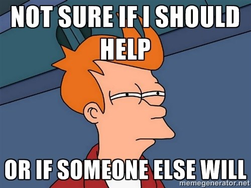

The room was quiet and the music soothing. After 50 minutes of flowing from pose to pose in a room approaching 95°F, the class collectively sank into matts and savored the respite. Everything was as it should be. Then a sneeze filled the air and the peace shattered, temporarily at least. Jolted out of my introspection, I thought about how I might have responded to her sneeze if I had been in a different setting. Certainly, I assumed, I would not have been as frustrated with the innocuous and natural occurrence, so why was I now - in Yoga where I was practicing mindfulness and understanding? Flitting past my self-criticism as quickly as possible, I decided I would do my best to make up for it and say "Gesundheit." (When asked afterward, why do I feel it's necessary to say anything, I stuttered and stammered until I declared that it was a nice thing to wish someone good health and it's a reminder of being part of a larger community). It's unlikely my words were heard by anyone else over the din of the music, but I felt satisfied, my anxiety dissipated, and I fell back into the flow of class.

After class, I couldn't stop thinking about how I had almost let the mere presence of others affect the way I would behave. No one had said, "shush." No one had looked sideways at me when I said, "Gesundheit" But, and possibly this is the point, no one else said anything at all - at least not that I could hear.

That others affect how we behave is well documented. The classic case study is the depressing [murder of Kitty Genovese](https://en.wikipedia.org/wiki/Murder_of_Kitty_Genovese) in 1960s New York. Despite multiple eye witnesses (as many as 38 are reported as having seen or heard the attack) no one intervened - either actively or passively, the event would launch a series of investigations into what would become known as the "[Bystander Effect](https://en.wikipedia.org/wiki/Bystander_effect)."

The experience of actively (and successfully) shocking my system to go from bystander to actor reminded me of a conversation I had with a friend earlier in the week. Discussing how we thought about meetings with leadership, I described a situation in which questions about methodology or data integrity would come up, two areas about which I am frequently better versed than anyone in the room. Despite this advantage, if I was not the one presenting, I would hesitate to interject and answer questions so as not to derail the conversation unless it was a crucial point and discussion would halt otherwise and prefer instead to close the loop after the meeting with a short memo. In these meetings, I ask myself a similar series of questions as those from the yoga matt: would others speak up? would people look at me if I answered the question from the periphery?

I think my preference to defer answering the question stems from the fact that I like the details and my natural inclination is to answer a question with all of the necessary caveats and nuance so ill-suited for conversation. When writing, I have more flexibility to answer the question briefly and provide support in footnotes or subsequent exchanges.

For me, the biggest difference is when I've prepared to present for a meeting, versus attend the meeting as an observer. In the former case, I have had ample time to think about how to simplify my message. Finding a way to package my ideas more quickly so that I can jump in has been something I continue to work on. I like to think I'm improving.