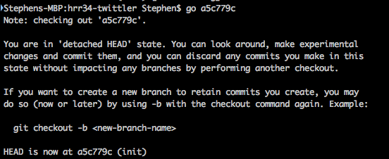

I got into a bit of a mess earlier today when I accidentally checked out an old state of my current branch _without_ creating a new branch for it. This resulted in a `detached HEAD` state.

 

Among other problems, this meant that when I looked at my history, it was just the initial commit (which was the hash `a5c779c` that I’d checked out).

 

I was able to recover the work because the past changes had been saved in my `.git` directory, but in order to recover them, I had to checkout that directory by name since it wasn’t part of the current stream. 

This was a scary moment, so I went about looking for a better way of doing things.

After reading several answers and articles on stackoverflow, medium, and other sites, the general approach I’ve seen boils down to a few steps that leverages branches — and thereby avoids the `detached HEAD` state.

Here are the steps: 
  1. Create a new branch for the new feature that I want to work on
  
    `$ git checkout [new branch name]`
  
  2. Make your changes to the branch

    Follow the standard workflow of tracking status `$ git status`, adding files for tracking `$ git add [file name]`, committing those changes with a message `$ git commit -m "[message for commit]"`.

  3. When you’re ready to merge the branch into your `master`, check out the master, `$ git checkout master` to return to the master branch

  4. [When working on a team where the master may have changed] Make sure that the `master` is up to date: 
    
    `$ git pull origin master`

  5. Merge the new branch into the `master` with `$ git merge [new branch name]`
  
  6. Now that the files are merged, you can delete old branches. One quick way to see what’s already been merged (and therefore ready to be deleted is `$ git branch --merged`.
  7. Once a branch has been merged, it can be safe to delete it. To do so, use `$ git branch -d [branch name]`
  8. Now, make sure that nothing hasn’t _yet_ been merged which should be using `$ git branch --no-merge`

   

   

Though these steps are a faithful reproduction of my process, the way I really got more comfortable was by creating a test repo and testing all of this out. Making frequent use of `$ git log`, `$ git branch`, and `$ git status`. 

# Resources
1. [Git - Basic Branching and Merging](https://git-scm.com/book/en/v2/Git-Branching-Basic-Branching-and-Merging) \- Unsurprisingly, the best resource I’ve found. Makes me wonder why I felt the need to re-write it, except that I I read this first and didn’t understand it until I read several other articles and tested it myself. Only now on revisiting it, does it make a ton more sense. 
2. [Git housekeeping tutorial: clean-up outdated branches in local and remote repositories](https://railsware.com/blog/2014/08/11/git-housekeeping-tutorial-clean-up-outdated-branches-in-local-and-remote-repositories/) \- Found this useful for an introduction to cleaning up old branches.
3. [Best (and safest) way to merge a git branch into master - Stack Overflow](https://stackoverflow.com/questions/5601931/best-and-safest-way-to-merge-a-git-branch-into-master) \- This Q&A addresses the additional complexity of what happens when the master changes (similar to the *hotfix* example in the Git - Basic Branching and Merging article).