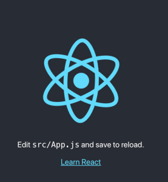

In an effort to learn React, I pulled up [React’s introductory tutorial](https://reactjs.org/tutorial/tutorial.html). Almost immediately I hit turbulence.

 

I was in the setup of the tutorial when I got my first error message in response to executing the `npm start` command. 

# Creating a React App

Creating a brand new React app is supposed to be easy. The React team has [step-by-step instructions](https://reactjs.org/docs/create-a-new-react-app.html) and a tool chain that’s supposed to make this painless. Apparently, I’m a glutton for pain, because I didn’t get a success message. Instead, I received this lovely novel-length error message:
```shell
Stephens-MBP:new-tic-tac-toe Stephen$ npm start

> new-tic-tac-toe@0.1.0 start /Users/Stephen/Documents/_coding/reactTicTacToe/new-tic-tac-toe
> react-scripts start


There might be a problem with the project dependency tree.
It is likely not a bug in Create React App, but something you need to fix locally.

The react-scripts package provided by Create React App requires a dependency:

  "babel-loader": "8.0.4"

Don't try to install it manually: your package manager does it automatically.
However, a different version of babel-loader was detected higher up in the tree:

  /Users/Stephen/node_modules/babel-loader (version: 8.0.2)

Manually installing incompatible versions is known to cause hard-to-debug issues.

If prefer to ignore this check, add SKIP_PREFLIGHT_CHECK=true to an .env file in your project.
That will permanently disable this message but you might encounter other issues.

To fix the dependency tree, try following the steps below in the exact order:

  1. Delete package-lock.json (not package.json!) and/or yarn.lock in your project folder.
  2. Delete node_modules in your project folder.
  3. Remove "babel-loader" from dependencies and/or devDependencies in the package.json file in your project folder.
  4. Run npm install or yarn, depending on the package manager you use.

In most cases, this should be enough to fix the problem.
If this has not helped, there are a few other things you can try:

  5. If you used npm, install yarn (http://yarnpkg.com/) and repeat the above steps with it instead.
     This may help because npm has known issues with package hoisting which may get resolved in future versions.

  6. Check if /Users/Stephen/node_modules/babel-loader is outside your project directory.
     For example, you might have accidentally installed something in your home folder.

  7. Try running npm ls babel-loader in your project folder.
     This will tell you which other package (apart from the expected react-scripts) installed babel-loader.

If nothing else helps, add SKIP_PREFLIGHT_CHECK=true to an .env file in your project.
That would permanently disable this preflight check in case you want to proceed anyway.

P.S. We know this message is long but please read the steps above :-) We hope you find them helpful!

npm ERR! code ELIFECYCLE
npm ERR! errno 1
npm ERR! new-tic-tac-toe@0.1.0 start: `react-scripts start`
npm ERR! Exit status 1
npm ERR! Failed at the new-tic-tac-toe@0.1.0 start script.
npm ERR! This is probably not a problem with npm. There is likely additional logging output above.
npm ERR! A complete log of this run can be found in:
npm ERR! /Users/Stephen/.npm/_logs/2018-10-18T14_51_23_773Z-debug.log
```
My favorite part? 

> P.S. We know this message is long but please read the steps above :-) We hope you find them helpful! 

It’s simple, but this sort of human touch absolutely makes a difference. On to the debugging! 

For brevity’s sake, I will skip over steps 1-5 as they were not my actual problem. 

# Issue 1
## Babel-Loader was globally installed

The first place where I actually seemed to have an issue was with step 6. `Babel-loader` was installed globally. 

```shell
  6. Check if /Users/Stephen/node_modules/babel-loader is outside your project directory.
     For example, you might have accidentally installed something in your home folder.
```

Uninstalling node packages is not something I do every day, so I found this [StackOverflow discussion](https://stackoverflow.com/questions/13066532/how-to-uninstall-npm-modules-in-node-js/13066677) on the topic helpful.

Returning to my bash terminal, I entered `$ npm -g uninstall babel-loader —save` and received back `up to date in .04s`. Success! Almost... `babel-loader` was still there in my global node_modules! 

(I used `$ npm -g ls` to see all globally installed modules.) 

# Issue 2
## Uninstall didn’t error, but also didn’t remove the module

It appears that only node packages that are at a depth of 0 can be uninstalled using the `$ npm -g uninstall <module_name> —save` command.

Lucky me - `babel-loader` wasn’t at that depth.

Again, returning to Stack Overflow for guidance, I found [this discussion](https://stackoverflow.com/questions/47763783/cant-uninstall-global-npm-packages-after-installing-nvm) helpful. 

> The list of things that you can npm uninstall -g is available at npm ls -g --depth=0 

To see which modules are available for uninstall, I used the command: `$ nvm use system && npm ls -g --depth=0`. The first half of the command was to see if `babel-loader` was pre-installed with my version of node (it wasn’t).

```shell
$ nvm use system && npm ls -g --depth=0

Now using system version of node: v8.12.0 (npm v6.4.1)
/usr/local/lib
├── bower@1.8.4
├── browserify@16.2.3
├── eslint@5.6.0
├── js-beautify@1.7.5
├── live-server@1.2.0
├── moment@2.22.2
├── nodemon@1.18.4
├── npm@6.4.1
├── tslint@5.11.0
└── typescript@3.0.1
```
# Solution
## Manually remove the directories

Since `npm uninstall` didn’t have access to `babel-loader` (or user error prevented it from removing it), I decided to attack the problem head-on.

I removed the `babel-loader` directory from my `User/Stephen/node_module` directory (`$ rm -rf babel-loader`).

When I ran `npm start` again I was greeted by success!
```shell
$ npm start

Compiled successfully!

You can now view react-pos in the browser.

  Local:            http://localhost:3000/
  On Your Network:  http://192.168.1.76:3000/

Note that the development build is not optimized.
To create a production build, use yarn build.
```
|  |
|:---:|
| *What success looks like!* | 

Time to celebrate! 

