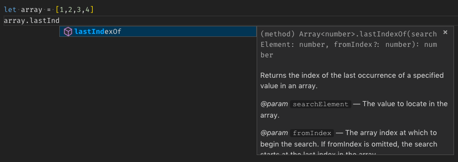

My very first introduction to code was with [~Introduction To Computational and Programming Using Python~](https://www.amazon.com/Introduction-Computation-Programming-Using-Python/dp/0262519631) by John V. Guttag. While I didn’t learn Python, I was exposed to certain concepts. [Some would lead me astray](https://stackoverflow.com/questions/51685550/why-do-i-need-length-to-find-the-equivalence-of-array-elements-in-a-for-loop) as I got into Javascript - like Python’s ability to access the last element of an array with the index `-1`. Others, like docstrings, just didn’t seem to be as emphasized. That text that “provide specifications of functions” and which can be accessed using the built-in `help`. But that’s where I was wrong — Javascript *has* docstrings (or its equivalent) and they’re the tooltips that I *love* in VSCode.

|  |
|:---:|
| *The built-in Array Method .lastIndexOf()* |


|  |
|:---:|
| *The built-in Array Property .length()* |

These guides are wonderful because they articulate the contract that you are agreeing to when you use the method or ask about the property. It’s like having MDN right there in your editor. No need to leave and look something up. In fact, that’s what I initially thought was happening - VSCode was plugging directly into MDN to pull down definitions. That, it turns out isn’t true. Rather, it’s actually quite easy to write your own descriptions.

# Write Your Own Contracts

Javascript, as is often the case, offers several different ways to write comments.

There’s `//` for a single line comment.

There’s `/* */` for single or multi-line comment.

Lastly, there’s `/** */`. This is a description. I think of it as Javascript’s equivalent to Python’s docstring.

You might see it more commonly in as a multi-line such as:

```Javascript
/**
 * The description begins here.
 * More description continues here.
 */
```

If you precede your function definitions *with* a description comment, VSCode will pick it up and include it as a tooltip. For example, I wrote a function to `removeLinkedListDuplicates`.

|  |
|:---:|
| *A custom function with a tool tip from its function description* |

## The Nitty Gritty - Where To Start
The process of writing your own function description is easy, though there’s still a lot that I’m learning about all of the different options.

My go-to resource for learning more is [Use JSDoc](http://usejsdoc.org).

```Javascript
/**
 * Foo takes any argument.
 * The return value is 'baz' in all cases.
 * @param {*} bar - Any argument
 * @param {string} [optionalArg] - An optional argument that is a string
 */
function foo(bar, optionalArg) {
  return 'baz';
}
```

## Optional Parameters: An Area For Further Investigation
According to [Use JSDoc](http://usejsdoc.org), `@param {*} [optionalParamName]` should refer to an optional parameter, however, VSCode is not currently picking that up.

Initial research seems to indicate that Typescript may offer more support on this front, but I haven’t gotten to the bottom of that yet.

In the meantime, I’ll be specifying in the description of the parameter that it’s optional.

# Why Write A Contract?
After all of this, you may be wondering *why* you should write contracts in the first place.

I see two main advantages in writing your own contracts:

  1. They allow you to forget what you wrote
  2. They communicate the purpose to someone

## The Magic Of Forgetting
Unless you’re a savant, you’re likely to forget exactly *why* you wrote code the way you did. That means that you’re going to spend your time refreshing yourself on the function when you come back to it later.

Descriptions can make that process much simpler by surfacing relevant information quickly - eliminating the need to walk through the logic of the code each time.

## Communicating With Others
Alternatively, imagine that you’re not the consumer. Put yourself in their shoes. Interfaces that are well documented and easy to understand are used more.

So, even if you take a purely selfish view - the better your descriptions are, the more likely someone will *use* it.

I’d say that makes it *more* than worth the time to write a clear description.