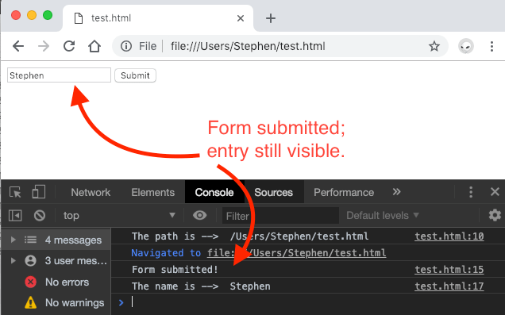

Two tools to keep in your tool belt when adding forms to your website should be:

  1. `Event.preventDefault()`
  2. `HTMLFormElement.reset()`

The reason is that by default, on submission of a form, the page will redirect and refresh. The biggest reason that this becomes a problem is that if you wanted to do anything *with* that information later on, you can’t. The assumption is that the form data is *sent off* and there is no reason to keep it on the client side after submission.

That may have been true(r) in the past, but as we move toward more and more client-side work, we don’t want to lose our user data to a refresh.

That’s where `Event.preventDefault()` comes in handy. The `HTMLFormElement.reset()` is much more of a user experience feature in this context. Because we’re not navigating to a new site or refreshing, if we *don’t* use `.reset()` the user is likely to wonder whether or not anything actually happened.

# Example Time!

Let’s imagine a basic form. It has one field to submit the customer’s name. In basic HTML, this form might look something like this.

```HTML
<div>
  <form class="form-class">
    <input type="text" name="customer" placeholder="Your Name" required>
    <input type="submit">
  </form>
</div>
```

## Adding A Basic Event Handler

Before we can see the value of the `preventDefault()` and `reset()` methods, we need to add a basic eventHandler. Imagine the following in a `<script>` tag for the HTML above.

```Javascript
// Create a variable that selects the form
let formClass = document.querySelector('.form-class')

// Define what happens on form submission
function submitForm(event) {
	console.log(`Form submitted!`);
	// The name the user types into the form.
	const name = document.querySelector('[name]').value;
  console.log(`The name is --> `, name);
}

// Add the event listner to the form
formClass.addEventListener('submit', submitForm);
```

If we were to open our page now and run our page, on submission, we’d likely see something like the following in our console.

|  |
|:---:|
| *The default form submission* |

Notice that _after_ we submitted the form, we navigated to a new path, and now included more information (`?customer=Stephen`)

## Use `preventDefault()` To Stop Sending Data / Redirecting
But unless you’re storing that form data somewhere, that redirection means that it’s lost to the ether.

Before we can prevent the redirect, we need a way to *see* it.

Adding `javascript> console.log("The path is --> ", window.location.pathname);` to the Javascript on the page will shine a light.

| |
|:---:|
| *The default form submission with path logging* |

But, now we actually want to *prevent* the redirect so that we maintain access to the information. We can do this by adding *one* line to our `submitForm` method.

```Javascript
function submitForm (event) {
  event.preventDefault(); // <-- This is the money line
  console.log(`Form submitted!`);
  const name = document.querySelector('[name]').value;
  console.log(`The name is --> `, name);
}
```

Now, even though the form is submitted, we do not redirect.


Woot! Okay, step one down. But, you may have noticed that the name you entered is still hanging out. Though the form was submitted, since the page wasn’t refreshed, the user’s entry is still there.



## Use `HTMLFormElement.reset()` To Clear A Form

Though, it’s likely the case that `HTMLFormElement.reset()` was envisioned to be used more in cases where a user wants to start over, the method works well in our case by clearing all user entries from the form _post_ submission since we prevented the default behavior.

> **Reminder:** The default behavior we prevented is tied to the `submit` event emitted by the form.

To modify our event handler to clear the entries *after* we’ve done what we needed to do, use the `.reset()` method on the form.
```Javascript
function submitForm (event) {
  event.preventDefault();
  console.log(`Form submitted!`);
  const name = document.querySelector('[name]').value;
  console.log(`The name is --> `, name);
  // Do anything else you want here
  formClass.reset(); // <-- Our *new* money line
}
```

The `formClass` variable *is* an HTMLFormElement and therefore has access to the reset method.


However, this could just as easily be written as
```JavaScript
function submitForm (event) {
  event.preventDefault();
  console.log(`Form submitted!`);
  const name = document.querySelector('[name]').value;
  console.log(`The name is --> `, name);
  // Do anything else you want here
  this.reset(); // <-- Our *new* money line
}
```
The reason `this` works, is because of the context in which the `submitForm` is invoked.

Recall, it was from an event listener that was attached to the `formClass`. If you look "to the left of the call-time dot" you’ll see that the context in which the `submitForm` function is run _is_ the form.

Personally, I prefer to be explicit wherever possible, however, it is worth understanding _how_ it works so that you can read someone else’s code if they do not have the same behaviors.

## Video Walkthrough
I put together this video walkthrough to demonstrate all of these details live.

`youtube: mokoauG3BAw`

# Further Reading

The HTMLFormElement has only three methods by default. The others are `reportValidity()` and `submit()`. There are, however, many events. Read more on [MDN](https://developer.mozilla.org/en-US/docs/Web/API/HTMLFormElement).

The `preventDefault()` method has no effect on non-cancelable events. But you can learn more about the nuances on [MDN](https://developer.mozilla.org/en-US/docs/Web/API/Event/preventDefault).

Thanks to Wes Bos and his [JavaScript 30 Course](https://javascript30.com/) for the inspiration to learn more about these methods.

```javascript
<div>
  <form class="form-class">
    <input type="text" name="customer" autocomplete="off" placeholder="Your Name" required>
    <input type="submit">
  </form>
</div>

<script>
  console.log(`The path is --> `, window.location.pathname);
  let formClass = document.querySelector('.form-class');
  function submitForm (event) {
    event.preventDefault();
    console.log(`Form submitted!`);
    const name = document.querySelector('[name]').value;
    console.log(`The name is --> `, name);
    // Do anything else you want here
    formClass.reset();
  }
  formClass.addEventListener('submit', submitForm);
</script>
```