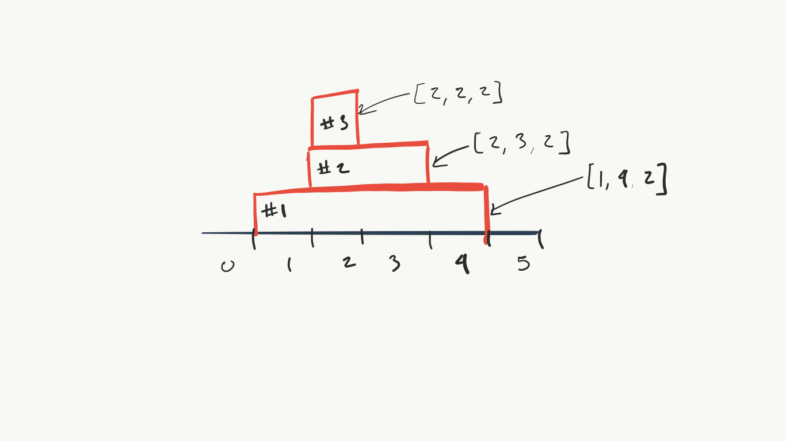

# Difference Arrays

Imagine you’re given a problem that says for each “query” in the format `[a,b,k]` add `k` to all elements of an array of zeros with a length of `n`, between indices `a` and `b` inclusive.

# Initial Construction
Let’s make this a little more concrete with an example.
``` js
const n = 6;
const queries =
[
  [1, 4, 2],
  [2, 3, 2],
  [2, 2, 2],
]
```
So, in our first step, we’re going to add 2 to each index between 1 and 4 inclusive, and so on. This means the array ends up going through the following permutations:
```
[0,0,0,0,0,0]
[0,2,2,2,2,0]
[0,2,4,4,2,0]
[0,2,6,4,2,0]
```
If each element in the array represented a height, you might see a bell curve, slightly skewed to its left. Seeing it as a bell curve really helped me understand *why* you could do this much more efficiently using what Geeks For Geeks calls a Difference Array.


This approach certainly works, but it’s not very efficient. For *each* query, we have to iterate over a subsection of the empty array with length n. If we say we have m queries, that gives us a time complexity of `O(n x m)`. We can do better.

# Differences For The Win
Looking at the above picture, you may have noticed  that I included the differences for an element with the preceding one.

The second element is two bigger than the first. The third is an additional four larger than the second. The third is two *smaller* than the second. So on and so forth.

Said another way, instead of writing the absolute values of each element, we could describe the same curve through its differences. If we were to re-write the above array in that way, we’d see `[0,2,6,4,2,0]` becomes `[2,4,-2,-2,-2,0]` .



Is there a fast way to figure out *what* those differences are? It turns out there is! And it takes advantage of the fact that we’re building this curve in layers.

## Step Through The Example
Let’s take the queries one at a time.

### Query One
The first query is: `[1,4,2]`. This  creates the row `[0,2,2,2,2,0]`.
From a difference perspective this is  `[2,0,0,0,-2,0]`.
Reasoning through it this says: We build a level of two high between 1 and 4 inclusive. So, at index 0, we need to be able to increase to in order to be at the right height for index 1. Then, at index 4, we’re done. So, we need to drop off by the same amount as we just added. That’s a -2.

### Query Two
Query two is similar: `[2,3,2]`.
On its own, this creates the row `[0,0,2,2,0,0]`, but we already had built a layer, so we would be at `[0,2,4,4,2,0]`.
We really care about the impact this new layer has on our differences, so by focusing on differences we see that we need to +2 to the second element (index 1) in order to get up to 4. We also need to subtract two at the fourth element (index 3).
For this row alone then, our difference array is `[0,2,0,-2,0,0]`. Updating our difference array, we now have `[2,2,0,-2,-2,0]`.

### Query Three
Let’s wrap this up with query three: `[2,2,2]`.
This would create the row `[0,0,2,0,0,0]`, but in our situation results in `[0,2,6,4,2,0]`.
Focusing on differences we know we need to jump up two at the second element (index 1) in order to build our level and drop off at our third element (index 2) in order to be back on the right level for what comes after.
That means our difference array for this row is `[0,2,-2,0,0,0]`.
That’s what we needed. Now we know our final difference array would be: `[2,4,-2,-2,-2,0]`.

# Programming The Solution
```js
const n = 6;
const queries = [
  [1, 4, 2],
  [2, 3, 2],
  [2, 2, 2],
];
function findDifferenceArray(n, queries) {
  // make an array of 0s that is n length;
  const arr = [...Array(n)].fill(0);

  // for each query, find the difference between where the layer starts and the preceding step
  for (let i = 0; i < queries.length; i += 1) {
    // where the query *starts* building
    arr[queries[i][0]-1] += queries[i][2]
    // what about the difference for the step *after* we *stop* building?
    if (arr[queries[i][1]]!== undefined) {
      arr[queries[i][1]] -= queries[i][2]
    }
  }
  return arr;
}

console.log(findDifferenceArray(n,queries)); // [2,4,-2,-2,-2,0]
```

# Conclusion
When I first found this solution (after quite a while of trying to come up with my own), I wasn’t sure how it worked.

It was only when I went through this process of mapping it out step by step that I saw *why* we could ignore all of the intermediate steps.

It should be noted that while my example was ordered in that all queries progressively became smaller, that was for illustrative purposes. This approach still works whether or not all of the steps are the same size or overlapping.

# Resources
[Array Manipulation | HackerRank](https://www.hackerrank.com/challenges/crush/problem) - Where I first came across the problem
[Difference Array | Range update query in O(1) - GeeksforGeeks](https://www.geeksforgeeks.org/difference-array-range-update-query-o1/) - An explanation for *how* to code the Difference Array