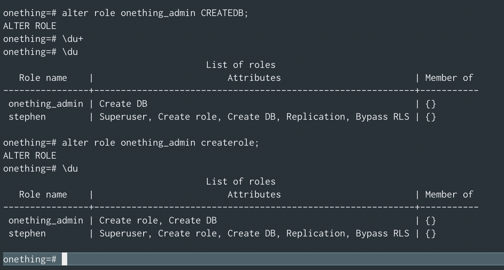

Before you can [connect to a Postgres database](../../2018-08-19/access-psql-via-shell/) from the command line, it needs to be running.

If it’s been a while, it’s easy to forget how to do that.

When installing via Homebrew, there’s a useful reminder:

```shell
postgresql
To migrate existing data from a previous major version of PostgreSQL run:
  brew postgresql-upgrade-database

To have launchd start postgresql now and restart at login:
  brew services start postgresql
Or, if you don't want/need a background service you can just run:
  pg_ctl -D /usr/local/var/postgres start
```

If this is the first time you’re starting Postgres, the next things you may want to do are:

1. Create a database to connect to
2. Create a user other than your superuser to handle routine management.<sup>[1](#footnotes)</sup><a id="fn1"></a>
3. Adjust roles for the new user

Below is a quick tutorial on how to do all of those:

## Create The Database

Once the postgres service is started, the first thing we’ll need is a database. We can create the database using `createdb` from bash:<sup>[2](#footnotes)</sup><a id="fn2"></a>

```shell
$ createdb <database_name>
```

After we have our first database, we can login and create databases from within the postgres shell, however, the first one needs to happen from the bash shell - or you’ll get the error:

> FATAL: database <user> does not exist
> psql: FATAL: database <user> does not exist

## Create The User

Now that we have a database, we will want to create the second (non super) user. For that, we have the `createuser` command from the terminal.<sup>[3](#footnotes)</sup><a id="fn3"></a> Or, if we log into the database (using the name of the database we just created) we can create the user within the `psql` shell (which you'll know you're in because instead of the prompt beginning with `$` for bash or `#` for zsh, you'll see `<database_name>=#`).

### Creating User In The Bash Shell

```shell
$ createuser <username> --pwprompt
```

The `--pwprompt` is to secure the new user with a password.

### Creating A User Within The PSQL Shell <sup>[3](#footnotes)</sup><a id="fn3"></a>

```sql
<database_name>=# create user <username> [with password '<password>']
```

### Roles And Permissions

At this point, you should be able to see your new role using the `\du` command within the `psql` shell:


The thing to notice is that this does not apply a role to the user - which will limit the ability for them to do much within the database once they login.

## Alter The Role

Postgres recommends having a user who can create databases and roles but is _not_ a super user.

To do that, we’ll want to provide the attributes of `createdb` and `createrole` to our new role without making them a superuser.

From within the Postgres shell, we can use the `ALTER ROLE` command:<sup>[4](#footnotes)</sup><a id="fn4"></a>

```sql
<database_name>=# alter role onething_admin CREATEDB;
<database_name>=# alter role onething_admin createrole;
```



> Update:
> If you forgot to set a password when you created the user, you can do it now by altering the user.<sup>[5](#footnotes)</sup><a id="fn5"></a> > `sql> <database_name>=# alter role onething_admin with password '[new_password]';`

## Wrap Up

Confirm that your new user is created as expected by logging into them.

Exit the Postgres shell and try logging in as your new user.

If the command prompt is `<database_name>=>` - terminating with an `>` instead of the `#`, then you know you’re not signed in as a super user.


## Footnotes

- <sup>[1](#fn1)</sup> The [Postgres documentation on role attributes](https://www.postgresql.org/docs/8.1/role-attributes.html) states: “It is good practice to create a role that has the CREATEDB and CREATEROLE privileges, but is not a superuser, and then use this role for all routine management of databases and roles. This approach avoids the dangers of operating as a superuser for tasks that do not really require it."
- <sup>[2](#fn2)</sup> For more information on this command, checkout the [createdb manual page](https://linux.die.net/man/1/createdb) or the [Postgres documentation on create database](https://www.tutorialspoint.com/postgresql/postgresql_create_database.htm).
- <sup>[3](#fn3)</sup> For more info on `createuser` - checkout the [createuser man page](https://linux.die.net/man/1/createuser) or for [Postgresql documentation on create user](https://www.postgresql.org/docs/8.0/sql-createuser.html) for guidance on creating users within the Postgres shell.
- <sup>[4](#fn4)</sup> For more information on `alter user` - we have [PostgreSQL: Documentation: 9.1: ALTER ROLE](https://www.postgresql.org/docs/9.1/sql-alterrole.html)
- <sup>[5](#fn5)</sup> I found [this discussion on the difference between user and role (and group) on StackOverflow](https://stackoverflow.com/questions/27709456/what-is-the-difference-between-a-user-and-a-role) really insightful. The punchline for me was:
  > In modern versions of Postgres, the two concepts [users and groups] have been merged: a "role" can have the ability to login, the ability to "inherit" from other roles (like a user being a member of a group, or a group being a member of another group), and access to database objects.
  > [...]
  > Postgres still accepts commands using the old terminology, such as [CREATE USER](https://www.postgresql.org/docs/current/sql-createuser.html) and [CREATE GROUP](https://www.postgresql.org/docs/current/sql-creategroup.html) which are both aliases for [CREATE ROLE](https://www.postgresql.org/docs/current/sql-createrole.html).
