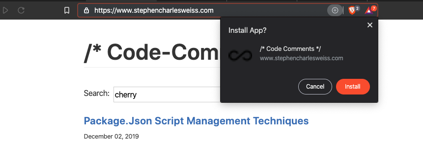
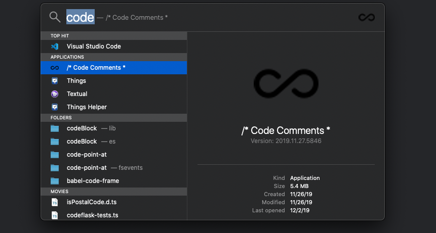
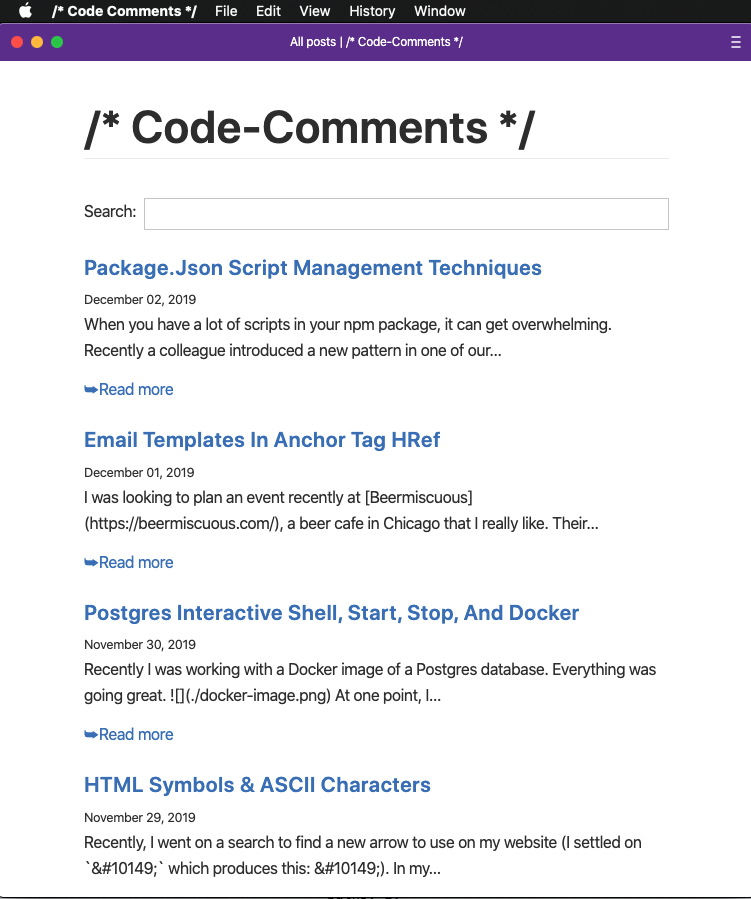

There's a lot to learn in terms of taking advantage of all of the features included in Progressive Web Apps (PWAs), but as it relates to Code Comments (this blog), there are two I find particularly intriguing:
1. Interactivity even with spotty connections
2. "Native" feeling and "installability"

The blog is pretty bare-bones. State management is minimal. Authentication is non-existant. None the less, it can be useful to have the blog as a PWA.

Let's look at why and then how to do it.

If I'm looking at the home page of my website when my internet connection goes down, if I try to search, I can still do that because the entire index is local to the client. Then, when the internet connection comes back, it will load the page.

There's definitely more I should do here so that if the user tries to search for a page while the internet is out, it doesn't just die, but can fall back to an offline state.

The bigger reason why I'm so intrigued by the PWA features of my site, however is that it makes my blog into an "installable app".

Because of that, I can open it up in a separate context from my browser, which makes it so much easier to find when I have dozens of browser tabs in multiple windows open.

Installing the app is as simple as clicking the + button in the address bar of a browser (Right now, this only works on Chromium browsers, more to come):

Once installed, I can open it like a regular application.

Which creates a nice little container for my site.

Since my site is one of my primary reference documents, I find this really handy! Best of all, it comes out of the box with Gatsby.

For more information on PWAs and installing them, check out these resources:

1. [Gatsby Docs on Progressive Web Apps (PWA)](https://www.gatsbyjs.org/docs/progressive-web-app/)
2. [How to Geek on Installing PWAs](https://www.howtogeek.com/fyi/how-to-install-progressive-web-apps-pwas-in-chrome/)

I've also got a ticket to add additional PWA features on my site in the near future. Looking forward to digging in to make it even better (and learn a thing or two along the way!)
