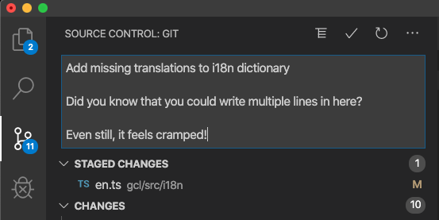

In his talk ["A Branch In Time"](https://tekin.co.uk/2019/02/a-talk-about-revision-histories) (which I wrote about recently in [Write Better Commit Messages](../../2020-02-06/write-better-commits), Tekin Süleyman has an offhand comment that I haven't been able to shake: "The command line doesn't encourage you to write descriptive commit messages."

Tekin suggested using a code editor instead and provided the code you'd need to make Sublime your default editor. I don't use Sublime though, and VSCode's built in Source Control module is actually pretty nice.

None the less, I find the editing experience cramped for commit messages - even after I figured out that you could type multiple lines - and I prefer to manage git from the command line for more fine control over what I'm doing.



Still, if there was an automated way to flip between the command line and VSCode to write a commit message, I'd happily try that. [Pawel Sołtysiak wrote a post detailing exactly that](https://blog.soltysiak.it/en/2017/01/set-visual-studio-code-as-default-git-editor-and-diff-tool/)!

There's only one command to run:

```shell
$ git config --global core.editor "code --wait"
```

Pawel notes that the `--wait` flag is to ensure `git` waits until the VSCode window is closed before continuing.

He also added a second tip related to `diff`s and the `difftool`. To use VSCode for diffs, add the following lines to your `.gitconfig` file<sup>[1](#footnotes)</sup><a id="fn1"></a>:

```shell:title=.gitconfig
[diff]
    tool = vscode
[difftool "vscode"]
    cmd = code --wait --diff $LOCAL $REMOTE
```

In the past I haven't spent a lot of time comparing two diffs like this (relying instead on the VSCode module here), but it's nice to know how! It's even nicer when there's a more ergonomic way to do it.

## Footnotes

- <sup>[1](#fn1)</sup> While adding the first line can be done from the command line with `shell> $ git config --global diff.tool "vscode"`, I was not able to figure out how to add the second one specifying the `difftool`.
