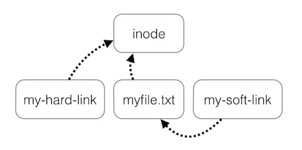

Recently, I wrote about some less than intuitive directory placement with respect to iCloud.

While an alias is one way to solve this issue, another is to use a symbolic link (commonly referred to as a symlink).

As I investigated creating links, I noticed there was a distinction between a [_hard_ link](https://en.wikipedia.org/wiki/Hard_link) and a [_soft_ (or symbolic) link](https://en.wikipedia.org/wiki/Symbolic_link).

## Pros And Cons Of Hard And Soft Links

Before digging into the differences, it's worth noting that in _most_ situations I've come across, the soft link is the preferred approach. Unlike hard links, soft links can be directories.

| Category        | Hard Link                                            | Soft Link                              |
| --------------- | ---------------------------------------------------- | -------------------------------------- |
| Disk Partition  | Files must be on same partition                      | No partition limitations               |
| Available Links | Files only                                           | Files or directories                   |
| Persistence     | Link remains even if the original is deleted / moved | Link is removed with the original file |

## Example

The following example demonstrating some of the differences between a hard link and symbolic link is derived from [this answer on askubuntu.com](https://askubuntu.com/a/801191), itself a derivative of these two answers on StackOverflow [here](https://stackoverflow.com/a/1531795) and [here](https://stackoverflow.com/a/29786294).

Starting with the basics. Hard links and soft links are really only comparable at the file level _because_ hard links can only be to files.

Let's envision a file `myfile.txt`:



Notice that the file also has a pointer to its location in the file system in the form of an [inode](https://en.wikipedia.org/wiki/Inode).

With this understanding, the diagram makes it clear that a hard link is a pointer to the inode itself and _not_ the file. This is in contrast to the soft link which points to the filename.

To see the implications of this, an example is useful:

```shell
$ touch fileOne; echo "Cat" > fileOne;
$ touch fileTwo; echo "Dog" > fileTwo;
```

Confirm the data was written successfully:

```shell
$ cat fileOne; cat fileTwo;
Cat
Dog
```

At this point, we have two equivalents to the `myfile.txt` in the diagram above. Let's examine how hard and soft links differ by creating one for each and then _moving_ the underlying file.

To create the links, we'll use the [`ln` utility](https://linux.die.net/man/1/ln).

First, the hard link:

```shell
$ ln fileOne fileOne-hard
```

(The first argument is the target, the second is the name of the new link we're creating)

Now the soft link:

```shell
$ ln -s fileTwo fileTwo-soft
```

If we look at our directory now:

```shell
$ ls -la
total 24
drwxr-xr-x   6 stephen  staff   192B Mar  6 11:11 .
drwxr-xr-x+ 81 stephen  staff   2.5K Mar  6 11:11 ..
-rw-r--r--   2 stephen  staff     4B Mar  6 10:50 fileOne
-rw-r--r--   2 stephen  staff     4B Mar  6 10:50 fileOne-hard
-rw-r--r--   1 stephen  staff     4B Mar  6 10:51 fileTwo
lrwxr-xr-x   1 stephen  staff     7B Mar  6 11:11 fileTwo-soft -> fileTwo
```

We can see the links have been created. Now let's start changing the original files by moving them and see how this affects our links:

```shell
$ mv fileOne newFileOne
$ mv fileTwo newFileTwo
$ ls -la
total 24
drwxr-xr-x   6 stephen  staff   192 Mar  6 11:25 .
drwxr-xr-x+ 81 stephen  staff  2592 Mar  6 11:25 ..
-rw-r--r--   2 stephen  staff     4 Mar  6 10:50 fileOne-hard
lrwxr-xr-x   1 stephen  staff     7 Mar  6 11:11 fileTwo-soft -> fileTwo
-rw-r--r--   2 stephen  staff     4 Mar  6 10:50 newFileOne
-rw-r--r--   1 stephen  staff     4 Mar  6 10:51 newFileTwo
```

We can already start to suspect a problem at this point: `fileTwo-soft` is _pointing_ to `fileTwo` which no longer exists! But let's see it in practice:

```shell
$ cat fileOne-hard
Cat
$ cat fileTwo-soft
cat: fileTwo-soft: No such file or directory
```

And what about if we _delete_ the original files altogether?

```shell
$ rm newFileOne; rm newFileTwo; ls -la
total 8
drwxr-xr-x   4 stephen  staff   128 Mar  6 11:27 .
drwxr-xr-x+ 81 stephen  staff  2592 Mar  6 11:27 ..
-rw-r--r--   1 stephen  staff     4 Mar  6 10:50 fileOne-hard
lrwxr-xr-x   1 stephen  staff     7 Mar  6 11:11 fileTwo-soft -> fileTwo
```

Our links are still there, but... while `fileOne-hard` still points to the data:

```shell
$ cat fileOne-hard
Cat
```

The soft link is linked to a non-existant file and so will error if we try to access it.

This demonstrates the biggest risk (in my opinion) with soft links: moving the underlying data _breaks_ the link. Still, in that case, it's a matter of recreating the link and then carrying on.
