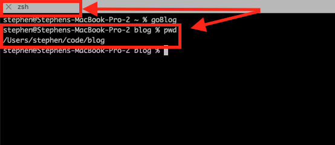
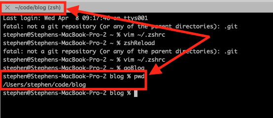
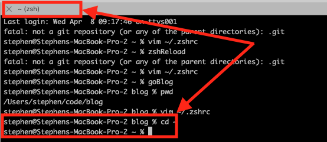

Understanding where you are in your terminal can be a useful piece of information.

While you can always find it by printing the working directory, certain terminals can provide that information for you in the UI.

For example, in iTerm, it can be the name of the window.

To set it, I used the `precmd` function in zsh<sup>[1](#footnotes)</sup><a id="fn1"></a>

```shell:title="~/.zshrc"
# use precmd to name the window:
# e.g., /Users/stephen/projects/dotfiles -> ~/p/dotfiles
function precmd() {
  window_title="\e]0;${${PWD/#"$HOME"/~}/projects/p}\a"
  echo -ne "$window_title"
}
```

Once you save this function and reload your terminal, you can start to see the results.

Before we made the change:



Once refreshed, the precmd function fired and updated our window immediately:


And it will change anytime the directory changes:



## Footnotes
- <sup>[1](#fn1)</sup> For more options take a look at the rest of the hook functions in section 9.3.1 of the [zsh manual](http://zsh.sourceforge.net/Doc/Release/Functions.html)
