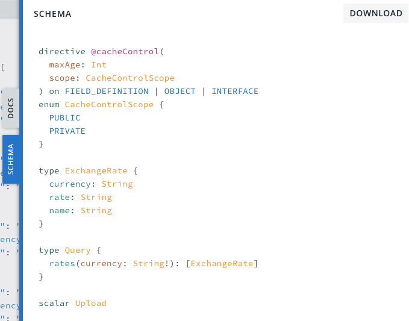

Yesterday, I wrote about [querying with Apollo](../../2020-05-05/querying-with-apollo-renderprops-vs-hooks). If you haven't read that, I suggest starting there as it serves as the basis for the files I'm using and the changes I've made.

Today, I wanted to revisit and go a little further: making queries dynamic by passing along user determined query parameters.

I've written in the past about the syntax for [using variables in GraphQL queries](../../2019-07-24/graphql-variable-queries/), and yet, I've never actually _generated_ dynamic queries from the front end.

This is an attempt to fix that and learn a thing or two along the way.

## Step One: Configure The Query To Accept Arguments
The first step is to make sure that our query is set up to accept arguments.

```diff:title=query.js
import { gql } from "apollo-boost";
export const EXCHANGE_RATES = gql`
-  {
+  query EXCHANGE_RATES($currency: String!) {
    rates(currency: $currency) {
      currency
      rate
    }
  }
`;
```
Naming our query, at all, let alone the same as our constant is not strictly necessary - it's just helpful for debugging purposes.

The important thing here is that the query now takes an argument `$currency` which is a string and required (note the `!`). It needs to be required because the query for rates requires a currency (which is visible by [inspecting the schema of our server](https://48p1r2roz4.sse.codesandbox.io/)).



## Updating Our Components
Now that our GraphQL query is set up to take an argument, we just need to tell our queries what to take.

In this case, we could hard code it again, just to prove to ourselves that the query is receiving the prop, but I've decided to jump straight to passing along a prop.
### Render Props Variant

```diff:title=ExchangeRateRenderProps.js
//...
- export function ExchangeRateRenderProps() {
+ export function ExchangeRateRenderProps(props) {
  return (
-    <Query query={EXCHANGE_RATES}>
+    <Query query={EXCHANGE_RATES} variables={{ currency: props.currency || "" }}>
      /* ... */
    </Query>
  );
}

```

### Hooks Variant
``` diff:title=ExchangeRateHooks.js
//...
- export function ExchangeRatesHooks() {
+ export function ExchangeRatesHooks(props) {
-  const { loading, error, data } = useQuery(EXCHANGE_RATES)
+  const { loading, error, data } = useQuery(EXCHANGE_RATES, {
+    variables: { currency: props.currency || "" }
+  });
  /*...*/
}

```

### Last Step
Once the components have been updated, we just need to pass the data along.

To keep things simple, I just have two buttons to pick from `USD` and `EUR`.

```diff:title=App.js
- function Switch() {
+ function Switch(props) {
	//...
  return (
    <div>
		{/*...*/}
      {view === "HOOKS" ? (
-        <ExchangeRatesHooks />
+        <ExchangeRatesHooks currency={props.currency} />
      ) : (
-        <ExchangeRateRenderProps currency={} />
+        <ExchangeRateRenderProps currency={props.currency} />
      )}
    </div>
  );
}

//...
export default function App() {
+  const [currency, setCurrency] = useState("USD");
  return (
    <ApolloProvider client={client}>
+      <div>
+        <h1>The current currency is {currency}</h1>
+        <div style={{ display: "flex" }}>
+          <span> Pick Your Currency:&nbsp;</span>
+          <button onClick={() => setCurrency("USD")}>USD</button>
+          <button onClick={() => setCurrency("EUR")}>EUR</button>
+        </div>
+      </div>
+      <hr />
-      <Switch />
+      <Switch currency={currency} />
    </ApolloProvider>
  );
}
```


## Conclusion
That really wasn't too bad! With just a few changes (and really, it could have been fewer if we were already set up to store user choices), we were able to pass along decisions made on the client side to dynamically change the data we are collecting from our GraphQL server!

As usual, I've made a [Code Sandbox](https://codesandbox.io/s/apollo-dynamic-queries-xbyph?file=/src/App.js:0-1344) for further exploration.

https://codesandbox.io/s/apollo-dynamic-queries-xbyph?file=/src/App.js:0-1344

Enjoy!
